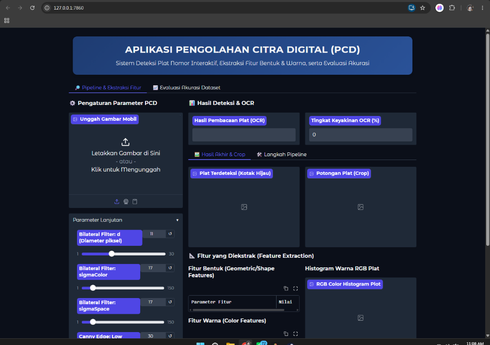
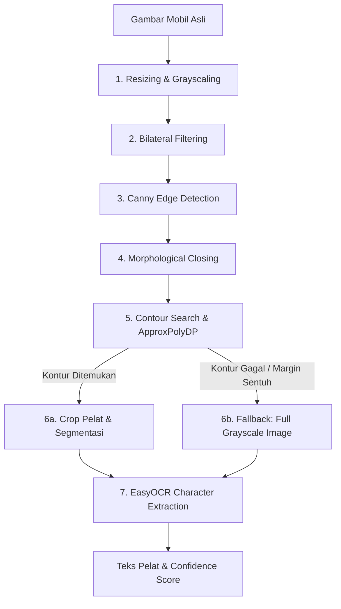
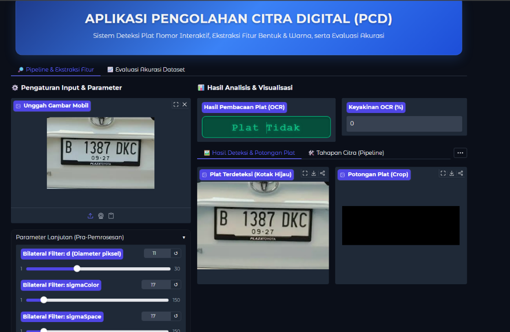
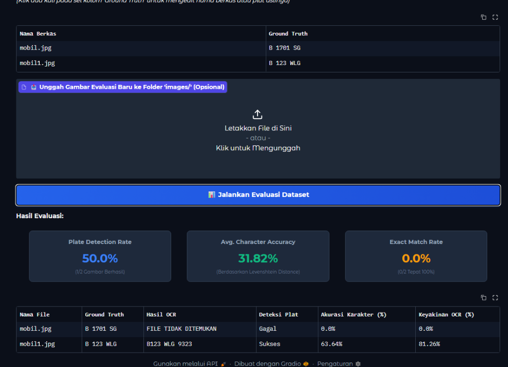
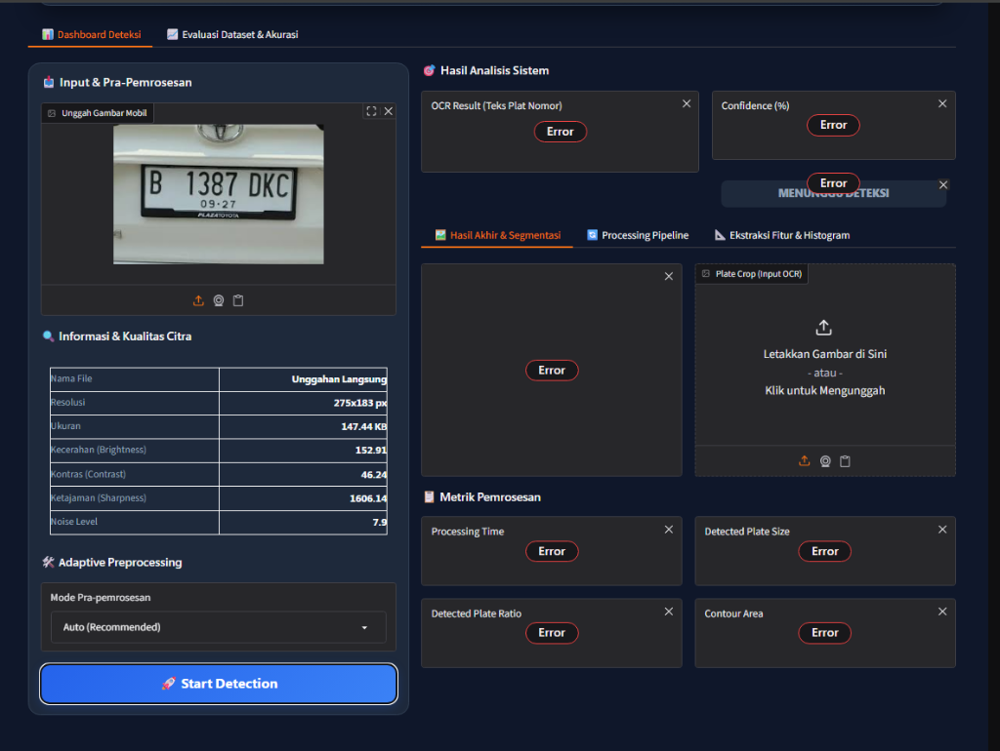
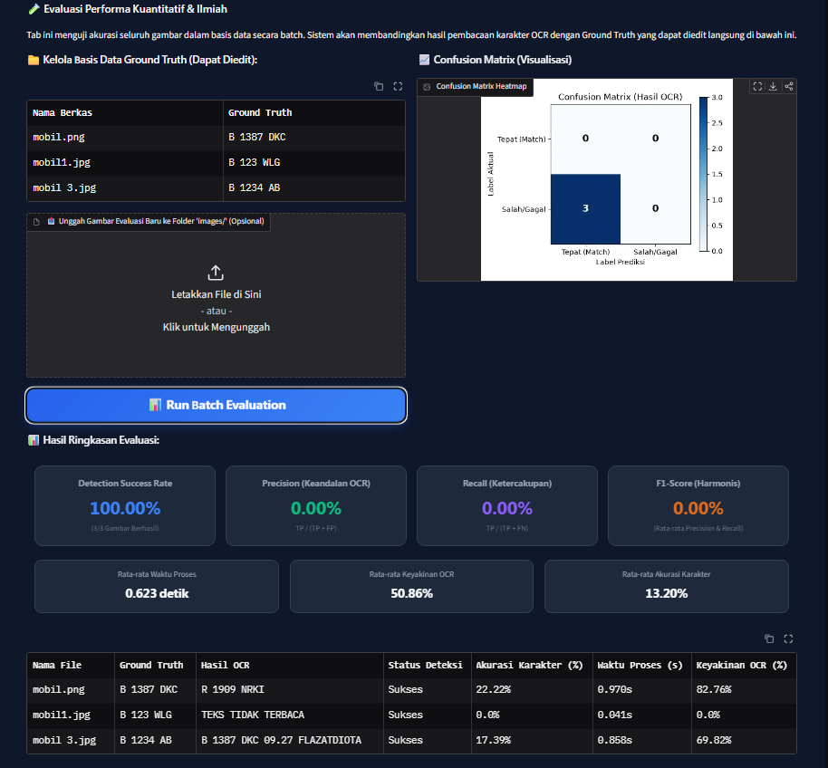

# 🚘 PLATEVISION: Smart License Plate Detection, Adaptive Preprocessing & OCR System

PlateVision adalah aplikasi Pengolahan Citra Digital (PCD) interaktif dan modular berbasis Python. Aplikasi ini dirancang khusus untuk memecahkan masalah deteksi pelat nomor kendaraan (*License Plate Recognition* - LPR) dalam berbagai kondisi lingkungan nyata. Menggunakan **OpenCV** untuk pemrosesan citra tingkat lanjut, **EasyOCR** untuk pengenalan karakter berbasis Deep Learning, dan **Gradio** sebagai antarmuka dashboard web yang modern, interaktif, dan responsif.

Sistem ini dilengkapi dengan modul analisis kualitas citra secara real-time dan evaluasi ilmiah berbasis metrik (Precision, Recall, F1-Score, dan visualisasi grafik *Confusion Matrix*).



---

## 📐 Arsitektur Sistem & Struktur Direktori

PlateVision dirancang dengan arsitektur modular yang memisahkan antara antarmuka pengguna (UI), kalkulasi utilitas, segmentasi citra, pengenalan karakter, dan modul evaluasi performa (*Clean Code Principle*).

### Struktur Berkas Proyek:
```text
d:\python\tugas-ambon\
├── .gradio/                 # Cache berkas temporary Gradio
├── .venv/                   # Virtual Environment Python
├── images/                  # Dataset gambar pengujian (.png / .jpg)
├── main.py                  # Entry Point aplikasi utama
├── ui.py                    # Tata letak interface Gradio & styling CSS kustom
├── utils.py                 # Kalkulator kualitas gambar & jarak karakter (Levenshtein)
├── preprocessing.py         # Logika penentu preset & parameter adaptif otomatis
├── detector.py              # Pemrosesan segmentasi citra & deteksi kontur OpenCV
├── ocr.py                   # Mesin ekstraksi karakter EasyOCR (Singleton CPU-only)
├── evaluation.py            # Kalkulator metrik klasifikasi & penggambaran Confusion Matrix
├── requirements.txt         # Daftar pustaka & dependensi sistem
└── setup_env.bat            # Skrip otomatis pembangun lingkungan lokal (Windows)
```

---

## 🛠️ Langkah Instalasi & Cara Menjalankan

Aplikasi ini dapat dipasang secara lokal pada sistem operasi Windows dan dijalankan secara online dengan tautan publik tanpa memerlukan akun hosting berbayar.

### Persyaratan Sistem:
*   Windows OS (7/10/11)
*   Python versi 3.8 hingga 3.12 (Disarankan)

### Cara Menjalankan:
1.  **Eksekusi Skrip Setup**:
    Cukup jalankan .\setup_env.bat di terminal.
    
     Skrip ini otomatis:
    *   Membuat Virtual Environment (`.venv`) di direktori proyek.
    *   Mengaktifkan virtual environment secara lokal.
    *   Meng-upgrade `pip`.
    *   Menginstal PyTorch versi CPU yang ringan (~180MB) untuk menghemat ruang penyimpanan.
    *   Menginstal seluruh pustaka yang tertera pada `requirements.txt`.
2.  **Menjalankan Server Web**:
    Buka Command Prompt (CMD) atau PowerShell di direktori proyek ini, kemudian jalankan perintah:
    .\.venv\Scripts\python.exe main.py
    ```
3.  **Mengakses Aplikasi**:
    *   **Akses Lokal**: Buka peramban (browser) Anda dan akses alamat `http://127.0.0.1:7860`.
    *   **Tautan Publik Gratis**: Terminal akan menghasilkan tautan Gradio Share (contoh: `https://xxxxxxxxxxxxxxxx.gradio.live`). Tautan ini aktif secara instan dan dapat dibagikan kepada dosen pengampu atau rekan kelompok selama terminal Anda tetap berjalan.

---

## 🔄 Alur Kerja Pengolahan Citra Digital (PCD)

PlateVision membagi alur pemrosesan citra ke dalam tahapan berurutan yang dapat dipantau langsung oleh pengguna melalui tab **"Processing Pipeline"**:





### Penjelasan Ilmiah Setiap Tahap:

1.  **Standardisasi Dimensi & Grayscaling**:
    Citra masukan diubah ukurannya menjadi lebar 600 piksel dengan mempertahankan aspek rasio konstan. Konversi ke ruang skala keabuan (*grayscale*) 8-bit menyederhanakan data warna 3-channel (RGB) menjadi informasi intensitas cahaya tunggal (Y) menggunakan rumus:
    $$Y = 0.299R + 0.587G + 0.114B$$

2.  **Bilateral Filtering (Penyaringan Preservasi Tepi)**:
    Berbeda dari filter Gaussian standar yang mengaburkan seluruh citra, Bilateral Filter menggunakan bobot spasial dan bobot intensitas piksel. Hal ini mereduksi noise (*smoothing*) tanpa merusak ketajaman garis batas pelat nomor (*edge preservation*):
    $$I^{\text{filtered}}(x) = \frac{1}{W_p} \sum_{x_i \in \Omega} I(x_i) f_r(\|I(x_i) - I(x)\|) g_s(\|x_i - x\|)$$

3.  **Canny Edge Detection**:
    Mendeteksi tepi halus pada citra dengan mencari gradien intensitas lokal menggunakan operator Sobel, diikuti oleh eliminasi piksel non-maksimum (*Non-Maximum Suppression*) dan *Hysteresis Thresholding* untuk menyambung tepi lemah dan membuang noise.

4.  **Morphological Closing (Morfologi Citra)**:
    Operasi penutupan (*Closing*) dibentuk oleh dilasi yang diikuti oleh erosi:
    $$A \bullet B = (A \oplus B) \ominus B$$
    Menggunakan **kernel horizontal berbentuk persegi panjang (rectangular kernel) berukuran $17 \times 3$**. Kernel horizontal ini disesuaikan dengan pola distribusi huruf dan angka pada pelat nomor kendaraan standar Indonesia (pola spasi horizontal) untuk menggabungkan karakter terpisah menjadi satu kesatuan blok kontur padat.

5.  **Analisis Kontur & Aproksimasi Poligon (Akurasi Pelokalan)**:
    Mencari kontur tertutup menggunakan algoritma penelusuran batas terluar. Kontur disaring berdasarkan kriteria:
    *   **Jumlah Sudut**: Aproksimasi poligon Douglas-Peucker (`cv2.approxPolyDP`) menyaring kontur yang memiliki **tepat 4 sudut**.
    *   **Aspek Rasio (L/T)**: Membatasi rasio horizontal pelat nomor kendaraan standar ($1.5 \le \text{Rasio} \le 6.0$).
    *   **Ukuran Luas Area**: Menyaring kontur yang terlalu kecil untuk membuang objek latar belakang non-pelat.

6.  **Sistem Fallback Cerdas (Robustness)**:
    Jika koordinat pelat gagal dideteksi (misalnya karena pelat terlalu dekat dengan bingkai foto sehingga kontur menyentuh batas tepi gambar dan gagal membentuk 4 sudut tertutup), sistem akan melakukan **Fallback otomatis**. Citra masukan yang telah disederhanakan dalam bentuk grayscale dikirimkan langsung ke modul OCR. Hal ini mencegah kegagalan total deteksi (*system crash*).

7.  **Model Deep Learning EasyOCR**:
    EasyOCR mengadopsi model *deep learning* yang terdiri dari arsitektur ResNet untuk ekstraksi fitur spasial teks, disusul oleh arsitektur Recurrent Neural Network (LSTM) untuk interpretasi deret karakter, dan diakhiri dengan algoritma pemetaan Connectionist Temporal Classification (CTC) untuk menghasilkan string teks akhir beserta skor keyakinan (*confidence level*).

---

## 🔍 Analisis Kualitas & Parameter Citra Adaptif

Aplikasi ini menyematkan modul **Kualitas Citra Otomatis** pada panel sidebar kiri yang mengkaji 4 parameter statistik citra:
*   **Kecerahan (Brightness)**: Rata-rata intensitas piksel skala abu-abu.
*   **Kontras (Contrast)**: Deviasi standar (*standard deviation*) dari nilai intensitas piksel.
*   **Ketajaman (Sharpness)**: Menggunakan variansi dari operator Laplace (*Variance of Laplacian*):
    $$\text{Sharpness} = \text{Var}(\nabla^2 I)$$
    Nilai variansi yang tinggi melambangkan transisi warna yang tajam (fokus baik), sedangkan nilai rendah melambangkan citra kabur.
*   **Noise Level**: Estimasi noise spasial melalui perbedaan selisih median absolut citra asli dengan citra hasil filter median.



### Preset Pemrosesan Adaptif:
Sistem secara otomatis menyesuaikan parameter filter dan ambang Canny berdasarkan kondisi kualitas citra yang diunggah (bila menggunakan mode **Auto**):

| Kondisi Presets | Batas Ambang Kualitas | Parameter Bilateral ($d, \sigma_c, \sigma_s$) | Ambang Canny ($\text{Low}, \text{High}$) |
| :--- | :--- | :--- | :--- |
| **Normal** | Kualitas ideal standar | $d=11, \sigma_c=17, \sigma_s=17$ | $\text{Low}=30, \text{High}=200$ |
| **Bright** | Kecerahan $> 175$ | $d=13, \sigma_c=25, \sigma_s=25$ | $\text{Low}=50, \text{High}=220$ |
| **Low Light** | Kecerahan $< 65$ | $d=9, \sigma_c=15, \sigma_s=15$ | $\text{Low}=15, \text{High}=120$ |
| **Night** | Kecerahan $< 40$ | $d=7, \sigma_c=12, \sigma_s=12$ | $\text{Low}=10, \text{High}=90$ |
| **Motion Blur** | Ketajaman $< 90$ | $d=5, \sigma_c=10, \sigma_s=10$ | $\text{Low}=20, \text{High}=150$ |
| **Rain/Fog** | Noise $> 32$ | $d=15, \sigma_c=45, \sigma_s=45$ | $\text{Low}=25, \text{High}=160$ |

---

## 📈 Metrik Evaluasi Ilmiah

Untuk memvalidasi akurasi sistem secara empiris pada data uji berkelompok (batch), PlateVision menggunakan metrik evaluasi klasifikasi biner dan evaluasi kemiripan teks:

1.  **Klasifikasi Deteksi & Pembacaan**:
    *   **True Positive (TP)**: Pelat nomor terdeteksi oleh OpenCV dan karakter dibaca 100% tepat oleh EasyOCR sesuai dengan *Ground Truth*.
    *   **False Positive (FP)**: Pelat nomor berhasil terdeteksi tetapi teks hasil bacaan EasyOCR memiliki kesalahan karakter atau tidak cocok dengan *Ground Truth*.
    *   **False Negative (FN)**: Pelat nomor gagal dideteksi koordinatnya oleh OpenCV ATAU teks hasil OCR kosong (tidak terbaca).

2.  **Metrik Performa Ilmiah**:
    *   **Precision** (Tingkat Ketepatan):
        $$\text{Precision} = \frac{\text{TP}}{\text{TP} + \text{FP}}$$
    *   **Recall** (Tingkat Keberhasilan Pengambilan):
        $$\text{Recall} = \frac{\text{TP}}{\text{TP} + \text{FN}}$$
    *   **F1-Score** (Rata-rata Harmonis Performa):
        $$\text{F1-Score} = 2 \times \frac{\text{Precision} \times \text{Recall}}{\text{Precision} + \text{Recall}}$$

3.  **Koreksi Karakter (Jarak Levenshtein)**:
    Menggunakan algoritma Levenshtein Distance untuk menghitung jarak perubahan karakter (penghapusan, penyisipan, substitusi) antara teks prediksi OCR dengan teks *Ground Truth* guna mengevaluasi persentase akurasi pembacaan karakter secara mikro (*Character Accuracy %*).

4.  **Visualisasi Confusion Matrix**:
    Menampilkan grafik heatmap interaktif $2\times2$ yang menggambarkan distribusi klasifikasi hasil prediksi sistem (*Predicted Class*) dibandingkan dengan data sebenarnya (*Actual Class*).


*Antarmuka Pengujian Batch Dataset*


*Visualisasi Matriks Kebingungan (Confusion Matrix)*

---

## 💎 Solusi Stabilitas Layout UI (Anti-Jitter / Anti-Vibration)

Pada versi pengembangan awal, antarmuka web mengalami masalah getar dan lompatan tata letak (*Cumulative Layout Shift* - CLS) saat proses deteksi dijalankan. Hal ini disebabkan oleh blok penampung gambar Gradio (`gr.Image`) yang memiliki tinggi dinamis. Saat gambar belum diunggah, tinggi elemen bernilai `0px`, dan melonjak menjadi `300px` saat gambar dirender, mendorong elemen-elemen di bawahnya ke bawah secara kasar.

**Solusi yang kami terapkan untuk mencapai estetika premium:**
1.  **Fixed Element Heights**: Menetapkan parameter `height=280` pada masukan gambar dan `height=150` pada sub-elemen pipeline pemrosesan citra.
2.  **Secondary Tab Placement**: Memindahkan visualisasi pipeline pemrosesan citra (`Grayscale`, `Bilateral`, `Canny`, dsb.) ke dalam tab-tab terpisah (`gr.TabItem`) sehingga elemen visual hanya dimuat saat tab diklik oleh pengguna.
3.  **CSS Overflow Table Limit**: Membatasi tinggi tabel dataframe dengan mendefinisikan kelas `.table-fixed` berkemampuan *scroll* (`max-height: 250px !important; overflow-y: auto !important;`) sehingga tabel Ground Truth tidak membesar secara vertikal saat baris data baru ditambahkan.

---

## 👥 Pengembang Proyek (Kelompok)

*   **[Nama Mahasiswa 1]** - (NIM: [NIM 1]) - Kontributor Modul Pipeline OpenCV & Segmentasi
*   **[Nama Mahasiswa 2]** - (NIM: [NIM 2]) - Kontributor Desain Antarmuka Gradio & Modul CSS
*   **[Nama Mahasiswa 3]** - (NIM: [NIM 3]) - Kontributor Evaluasi Metrik & Dokumentasi Ilmiah

*Proyek Akhir ini diajukan untuk memenuhi nilai Mata Kuliah Pengolahan Citra Digital.*
